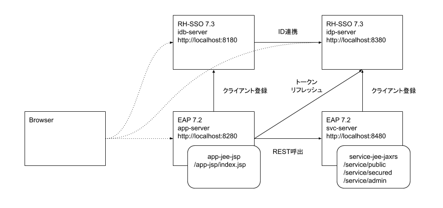

# 構成図



# 環境構築

__注意__

マスターブランチのstandalone.*やアプリケーションのプロジェクトはすでに
本手順を最後まで行ったものになっているので、重複して設定や変更を行う必要はないが、
RH-SSOに対する設定やアプリケーションに配置するkeycloak.jsonの取得は
各自が行う必要がある。

製品インストール直後の初期状態から本手順を適用して全てを再構築する場合は、
以下の手順で初期状態をチェックアウトして始めるといい。

```shell
$ git clone identity-brokering another-identity-brokering
$ cd another-identity-brokering
$ git checkout -b mybranch 00_out-of-the-box
```


## RH-SSOのインストール

[RH-SSO 7.3.0][rhsso730]をダウンロードし、任意の場所に展開する。
既存のインストレーションを用いても構わない。

本番環境の場合は、[パッチ][rhsso733-patch]も適用すること。

## EAPとアダプターのインストール

[EAP 7.2.0][eap720]をダウンロードし、任意の場所に展開する。
既存のインストレーションを用いても構わない。

次に、[EAP 7用のRH-SSOアダプター][rhsso730adapter]をダウンロードし、
上記EAPのインストレーションに被せるように展開する。
これにより、`modules/system/add-ons/keycloak`配下にRH-SSOのアダプターが、
また`bin`配下に設定用のCLIファイルが置かれる。

本番環境の場合は、[EAPのパッチ][eap723-patch]および
[アダプターのパッチ][rhsso733adapter-patch]も適用すること。

## 環境変数とヘルパー関数の設定

`helper.sh`に各サーバーの起動やCLIによるアクセス、アプリケーションのビルド等を
簡単に呼び出せるようにするための関数を定義している。
そこで`SSO_HOME`と`EAP_HOME`の環境変数を使うため、
各サーバーのインストレーションを指すように設定し、
`helper.sh`を読み込ませる。

また、後にidp-serverにidb-serverをクライアントとして登録するが、
その際のクライアントシークレットを`IDB_CLIENT_SECRET`として設定しておく。
環境を最初に構築するときはひとまずスキップして構わない。
この環境変数はapp-serverの起動時に使用される。

```shell
export SSO_HOME=/path/to/rh-sso-7.3
export EAP_HOME=/path/to/jboss-eap-7.2
export IDB_CLIENT_SECRET=659411b0-e3ad-44c6-bdea-c1227c53b1b1
. helper.sh
```

## 各サーバーの起動確認と初期設定

各サーバーは本ディレクトリ内の`standalone.*`を使うように起動され、
インストレーション配下に書き込みは行わない。

RH-SSOのサーバーに対しては管理ユーザを登録し今後の設定作業に用いる。

EAPのサーバーに対してはRH-SSOが用意したCLIファイルによる設定を行う。
これによりstandalone.xmlにkeycloakサブシステムが追加され、
Java EE標準のFORM認証やBASIC認証だけでなくKEYCLOAK認証という種類が選択・使用可能になる。

### idb-server

```shell
$ idb-server
(RH-SSOの管理コンソールにアクセスし管理ユーザを登録する)
```

※`idb-server`は`helper.sh`内に登録されている関数で、以下同様。

| idbの管理コンソール         | http://localhost:8180/auth/ |
| idbの管理ユーザ             | admin                       |
| idbの管理ユーザのパスワード | RedHat1!                    |

### idp-server

```shell
$ idp-server
(RH-SSOの管理コンソールにアクセスし管理ユーザを登録する)
```

| idpの管理コンソール         | http://localhost:8380/auth/ |
| idpの管理ユーザ             | admin                       |
| idpの管理ユーザのパスワード | RedHat1!                    |

※RH-SSOの管理コンソールには同一ブラウザからは複数同時にログインできないので、
可能であれば別のブラウザからアクセスするといい。

### app-server

```shell
$ app-server &
$ app-cli --file=$EAP_HOME/bin/adapter-install.cli
$ app-cli :reload
```

### svc-server

```shell
$ svc-server &
$ svc-cli --file=$EAP_HOME/bin/adapter-install.cli
$ svc-cli :reload
```

## デバッグ用のサーバーの設定

### HTTPアクセスログの有効化

[EAP 7でアクセスログを有効化するナレッジベース][accesslog]を参考に、各サーバに設定する。

```shell
idb-cli '/subsystem=undertow/server=default-server/http-listener=default:write-attribute(name=record-request-start-time,value=true)'
idb-cli '/subsystem=undertow/server=default-server/host=default-host/setting=access-log:add(pattern="%h %l %u %t \"%r\" %s %b \"%{i,Referer}\" \"%{i,User-Agent}\" Cookie: \"%{i,COOKIE}\" Set-Cookie: \"%{o,SET-COOKIE}\" SessionID: %S Thread: \"%I\" TimeTaken: %T")'

app-cli '/subsystem=undertow/server=default-server/http-listener=default:write-attribute(name=record-request-start-time,value=true)'
app-cli '/subsystem=undertow/server=default-server/host=default-host/setting=access-log:add(pattern="%h %l %u %t \"%r\" %s %b \"%{i,Referer}\" \"%{i,User-Agent}\" Cookie: \"%{i,COOKIE}\" Set-Cookie: \"%{o,SET-COOKIE}\" SessionID: %S Thread: \"%I\" TimeTaken: %T")'

idp-cli '/subsystem=undertow/server=default-server/http-listener=default:write-attribute(name=record-request-start-time,value=true)'
idp-cli '/subsystem=undertow/server=default-server/host=default-host/setting=access-log:add(pattern="%h %l %u %t \"%r\" %s %b \"%{i,Referer}\" \"%{i,User-Agent}\" Cookie: \"%{i,COOKIE}\" Set-Cookie: \"%{o,SET-COOKIE}\" SessionID: %S Thread: \"%I\" TimeTaken: %T")'

svc-cli '/subsystem=undertow/server=default-server/http-listener=default:write-attribute(name=record-request-start-time,value=true)'
svc-cli '/subsystem=undertow/server=default-server/host=default-host/setting=access-log:add(pattern="%h %l %u %t \"%r\" %s %b \"%{i,Referer}\" \"%{i,User-Agent}\" Cookie: \"%{i,COOKIE}\" Set-Cookie: \"%{o,SET-COOKIE}\" SessionID: %S Thread: \"%I\" TimeTaken: %T")'
```

### Reauest Dumperの有効化

全てのリクエストとレスポンスのヘッダーをサーバーログに出力するよう設定する
（[参考ナレッジベース][requestdumper]）。
POSTリクエストの場合はボディの内容も出力される。
出力量は多くなるので注意を要する。

```shell
idb-cli '/subsystem=undertow/configuration=filter/expression-filter=requestDumperExpression:add(expression="dump-request")'
idb-cli '/subsystem=undertow/server=default-server/host=default-host/filter-ref=requestDumperExpression:add'

app-cli '/subsystem=undertow/configuration=filter/expression-filter=requestDumperExpression:add(expression="dump-request")'
app-cli '/subsystem=undertow/server=default-server/host=default-host/filter-ref=requestDumperExpression:add'

idp-cli '/subsystem=undertow/configuration=filter/expression-filter=requestDumperExpression:add(expression="dump-request")'
idp-cli '/subsystem=undertow/server=default-server/host=default-host/filter-ref=requestDumperExpression:add'

svc-cli '/subsystem=undertow/configuration=filter/expression-filter=requestDumperExpression:add(expression="dump-request")'
svc-cli '/subsystem=undertow/server=default-server/host=default-host/filter-ref=requestDumperExpression:add'
```


## アプリケーションのビルドとデプロイの確認

[app-jee-jsp][app-jee-jsp]と[service-jee-jaxrs][service-jee-jaxrs]は
いずれもクイックスタートにあるプロジェクトで、対になって動作する。
すなわち、後者がRESTエンドポイントを用意し、前者はそれを呼び出すUIを提供する。

ルートディレクトリにある[pom.xml][parent-pom.xml]には
Red HatのMavenリポジトリやRH-SSOのBOMの設定が行われ、
両プロジェクトから参照される。

これらはweb.xmlでKEYCLOAK認証を用いるよう設定されているので、
上記のEAPに対する設定が済んでいないとデプロイできない。

```shell
$ deploy-app
(app-jee-jspをビルドしapp-jsp.warを生成、app-serverにデプロイする)
$ deploy-svc
(service-jee-jaxrsをビルドしservice.warを生成、svc-serverにデプロイする)
```

### 各アプリケーションの説明

service-jee-jaxrsは以下のエンドポイントで簡単なRESTサービスを公開している。

- http://localhost:8480/service/public
- http://localhost:8480/service/secured
- http://localhost:8480/service/admin

ただしsecuredとadminはアクセス制限がかけられており、
それぞれuserロールおよびadminロールがないとアクセスできない。

app-jee-jspは以下のURLで、上記3つのエンドポイントを呼び出すためのUI画面を公開している。

- http://localhost:8280/app-jsp/index.jsp

呼び出し先のサーバーは、下記のクラスで
システムプロパティ`servcie.url`（または環境変数`SERVICE_URL`）を参照するようになっている。

- [./app-jee-jsp/src/main/java/org/keycloak/quickstart/appjee/ServiceLocator.java](./app-jee-jsp/src/main/java/org/keycloak/quickstart/appjee/ServiceLocator.java)

app-serverの起動時の引数でそのシステムプロパティを設定している。
認証や連携の設定を何もしていない状態では、publicの呼び出しのみが成功する。


## 各サーバーの再起動

各サーバーはCtrl-C等の通常のシグナルによる停止でも問題ないが、
CLIのshutdownコマンドも使うことができる。

```shell
$ idb-cli shutdown
$ idp-cli shutdown
$ app-cli shutdown
$ svc-cli shutdown
$ idb-server &
$ idp-server &
$ app-server &
$ svc-server &
```

必要に応じて`&`を付けてバックグラウンドで起動したり、別ターミナルで起動したりすること。


# idp-serverとservice-jee-jaxrsの設定

## idp-serverの設定

管理コンソール http://localhost:8380/auth/ に管理ユーザでログインし、
レルムidprealmを作成、ロールとユーザを下記のように作成する。

| 設定項目                                   | 設定値                                |
|--------------------------------------------|---------------------------------------|
| Add realm > Name                           | idprealm                              |
| Roles > Add Role > Role Name               | user                                  |
| Users > Add user > Username                | idpuser                               |
| Users > Add user > Email                   | idpuser@example.com                   |
| Users > Add user > First Name              | User                                  |
| Users > Add user > Last Name               | IdP                                   |
| idpuser > Credentials > New Password       | Password1! (Temporary: OFF)           |
| idpuser > Role Mappings > Available Roles  | "user"をAssigned Rolesに追加          |
| Roles > Add Role > Role Name               | admin                                 |
| Users > Add user > Username                | idpadmin                              |
| Users > Add user > Email                   | idpadmin@example.com                  |
| Users > Add user > First Name              | Admin                                 |
| Users > Add user > Last Name               | IdP                                   |
| idpadmin > Credentials > New Password      | Password1! (Temporary: OFF)           |
| idpadmin > Role Mappings > Available Roles | "user"と"admin"をAssigned Rolesに追加 |

登録したユーザでログインできるかどうかは下記のURLで試すことができる。

- http://localhost:8380/auth/realms/idprealm/account/

続いてservice-jee-jaxrsをクライアントとして登録する。

| 設定項目                                   | 設定値                                             |
|--------------------------------------------|----------------------------------------------------|
| Clients > Create > Client ID               | service-jee-jaxrs                                  |
| Clients > Create > Client Protocol         | openid-connect                                     |
| Clients > Create > Root URL                | http://localhost:8480/service                      |
| service-jee-jaxrs > Settings > Access Type | bearer-only                                        |
| service-jee-jaxrs > Installation           | "Keycloak OIDC JSON"を選択しファイルをダウンロード |

なお、生成されるパッケージ名がservice.warなため、URLのパスも/serviceになっている。

## service-jee-jaxrsの設定

先程ダウンロードしたkeycloak.jsonをconfigに配置し、デプロイする。

```shell
$ mv ~/Download/keycloak.json service-jee-jaxrs/config/
$ deploy-svc
```

なお、config配下に既存のclient-import.jsonとkeycloak-example.jsonは今回は使用しない。


# idb-serverとapp-jee-jspの設定

## idb-serverの設定

管理コンソール http://localhost:8180/auth/ に管理ユーザでログインし、
レルムidbrealmを作成する。
ロールとユーザはidprealmを参照するように後で設定するため、特に必要ない。

| 設定項目         | 設定値   |
|------------------|----------|
| Add realm > Name | idbrealm |

続いてapp-jee-jspをクライアントとして登録する。

| 設定項目                             | 設定値                                             |
|--------------------------------------|----------------------------------------------------|
| Clients > Create > Client ID         | app-jee-jsp                                        |
| Clients > Create > Client Protocol   | openid-connect                                     |
| Clients > Create > Root URL          | http://localhost:8280/app-jsp                      |
| app-jee-jsp > Settings > Access Type | confidential                                       |
| app-jee-jsp > Installation           | "Keycloak OIDC JSON"を選択しファイルをダウンロード |

なお、生成されるパッケージ名がapp-jsp.warなため、URLのパスも/app-jspになっている。


## service-jee-jaxrsの設定

先程ダウンロードしたkeycloak.jsonをconfigに配置し、デプロイする。

```shell
$ mv ~/Download/keycloak.json app-jee-jsp/config/
$ deploy-app
```

なお、config配下に既存のclient-import.jsonとkeycloak-example.jsonは今回は使用しない。


# idp-serverとidb-serverの連携のための設定

idb-serverにidp-serverをIdentity Providerとして設定し、
idp-serverのユーザでidb-serverにログインできるようにする。

## idp-serverの設定

管理コンソール http://localhost:8380/auth/ に管理ユーザでログインし、
idprealmのクライアントとしてidb-serverを登録する。

| 設定項目                                | 設定値                                                                      |
|-----------------------------------------|-----------------------------------------------------------------------------|
| Clients > Create > Client ID            | idb-sso-broker                                                              |
| Clients > Create > Client Protocol      | openid-connect                                                              |
| Clients > Create > Root URL             | http://localhost:8180/auth/realms/idbrealm/broker/idp-sso-provider/endpoint |
| idb-sso-broker > Settings > Access Type | confidential                                                                |
| idb-sso-broker > Credentials > Secret   | （値をコピーしておく）                                                      |

ここでコピーしたidb-sso-brokerのシークレットは
app-jee-jspがトークンをリフレッシュする際に必要になるので、
環境変数`IDB_CLIENT_SECRET`にも保存しておき、
app-serverの起動時に引き渡す。

```shell
export IDB_CLIENT_SECRET=659411b0-e3ad-44c6-bdea-c1227c53b1b1
(...)
function app-server() {
    JBOSS_HOME=${EAP_HOME} JAVA_OPTS=${JAVA_OPTS} \
              ${EAP_HOME}/bin/standalone.sh \
              -Djboss.server.base.dir=./standalone.app \
              -b 0.0.0.0 \
              -Djboss.socket.binding.port-offset=200 \
              -Dservice.url=http://localhost:8480/service \
              -Didb.client.secret=${IDB_CLIENT_SECRET} \
              $@
}
```

## idb-serverの設定

管理コンソール http://localhost:8180/auth/ に管理ユーザでログインし、
idbrealmにidp-serverをIdentity Providerとして登録する。

| 設定項目                                         | 設定値                                                                                                |
|--------------------------------------------------|-------------------------------------------------------------------------------------------------------|
| Identity Providers > Add provider...             | Keycloak OpenID Connect                                                                               |
| Add identity provider > Alias                    | idp-sso-provider                                                                                      |
| Add identity provider > Store Tokens             | ON                                                                                                    |
| Add identity provider > Stored Tokens Readable   | ON                                                                                                    |
| Add identity provider > Import from URL (最下部) | "http://localhost:8380/auth/realms/idprealm/.well-known/openid-configuration"を入力しImportをクリック |
| Add identity provider > Client ID                | idb-sso-broker                                                                                        |
| Add identity provider > Client Secret            | (idp-server側でコピーしておいた値)                                                                 |

これでidbrealmのログイン画面にidp-sso-providerのリンクができて、
idprealmのログイン画面へと遷移してそこでidprealmのユーザでログインし、
idbrealmに戻って来ることができるようになる。

ただし、app-jee-jspがservice-jee-jaxrsのREST呼び出しを成功させることはまだできない。
なぜなら、そのREST呼び出しのリクエストに正しいトークンを付けていないからである。


# app-jee-jspの改修

service-jee-jaxrsはidprealmの管理下であるため、
そのREST呼び出しにはidprealmが発行したトークンを使わねばならない。

一方、app-jee-jspはidbrealmの管理下であるので、
このアプリケーションでログインした時に得られるトークンはidbrealmのものである。

idprealmのトークンは、"Store Tokens"の設定によりidbrealmにも保存されている。
よってservice-jee-jaxrsへのアクセスにはその保存されたトークンを使うようにapp-jee-jspを改修する。

下記のクラスのうち、`ServiceClient`が実際のREST呼び出しを行っているので、
そこのアクセストークンを設定する箇所を変更する。
具体的な処理は全て`TdpTokenUtil`に含めてある。

- [./app-jee-jsp/src/main/java/org/keycloak/quickstart/appjee/ServiceClient.java](./app-jee-jsp/src/main/java/org/keycloak/quickstart/appjee/ServiceClient.java)
- [./app-jee-jsp/src/main/java/org/keycloak/quickstart/appjee/IdpTokenUtil.java](./app-jee-jsp/src/main/java/org/keycloak/quickstart/appjee/IdpTokenUtil.java)

`IdpTokenUtil`では、idp-serverへのアクセストークンの無い初回アクセス時に、
まずidb-serverへアクセスして"Store Tokens"により保存されたトークンを取得する。

そこで取得したアクセストークンが期限切れになると、2回目以降のアクセストークンは直接idp-serverから取得する。
この時にidb-sso-brokerのクライアントシークレットが必要になる。

それぞれのトークンレスポンスの例を、 https://jwt.io でデコードしたものと共にtoken-example.mdに収めた。

なお、idb-serverとapp-jee-jsp間でもトークンのやりとりは行われているが、
これはRH-SSOのアダプター内で自動化されておりユーザが意識することはない。
二つ目のRH-SSOサーバーであるidp-serverとの連携部分は自動化されていないため、
このような実装が必要になる。


# リンク集

[rhsso730]: https://access.redhat.com/jbossnetwork/restricted/softwareDetail.html?softwareId=64611&product=core.service.rhsso&version=7.3&downloadType=distributions "rh-sso-7.3.0.GA.zip"

[rhsso730adapter]: https://access.redhat.com/jbossnetwork/restricted/softwareDetail.html?softwareId=64591&product=core.service.rhsso&version=7.3&downloadType=distributions "rh-sso-7.3.0.GA-eap7-adapter.zip"

[rhsso733-patch]: https://access.redhat.com/jbossnetwork/restricted/softwareDetail.html?softwareId=72551&product=core.service.rhsso&version=7.3&downloadType=patches "rh-sso-7.3.3-patch.zip"

[rhsso733adapter-patch]: https://access.redhat.com/jbossnetwork/restricted/softwareDetail.html?softwareId=72531&product=core.service.rhsso&version=7.3&downloadType=patches "rh-sso-7.3.3-eap7-adapter.zip"

[eap720]: https://access.redhat.com/jbossnetwork/restricted/softwareDetail.html?softwareId=64311&product=appplatform&version=7.2&downloadType=distributions "jboss-eap-7.2.0.zip"

[eap723-patch]: https://access.redhat.com/jbossnetwork/restricted/softwareDetail.html?softwareId=71721&product=appplatform&version=7.2&downloadType=patches "jboss-eap-7.2.3-patch.zip"

[parent-pom.xml]: https://github.com/redhat-developer/redhat-sso-quickstarts/blob/7.3.x/pom.xml

[app-jee-jsp]: https://github.com/redhat-developer/redhat-sso-quickstarts/tree/7.3.x/app-jee-jsp

[service-jee-jaxrs]: https://github.com/redhat-developer/redhat-sso-quickstarts/tree/7.3.x/service-jee-jaxrs

[requestdumper]: https://access.redhat.com/solutions/2429371

[accesslog]: https://access.redhat.com/solutions/2423311

[rhsso-api]: https://access.redhat.com/webassets/avalon/d/red-hat-single-sign-on/version-7.3/javadocs/
